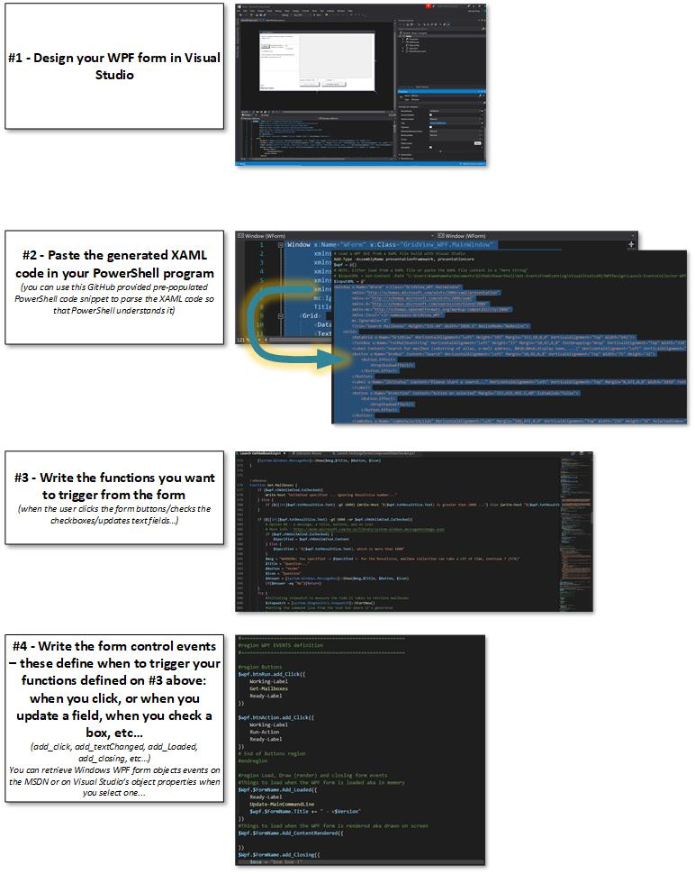

# Code-Snippet-WPF-and-PowerShell

This code is to provide a generic PowerShell code template so that we just need to paste the XAML code of a WPF form in the here-string provided.

You can also choose to get the XAML content from a file (using Get-Content and storing it in a PowerShell variable), instead of using a Here-String with the code pasted inside...

Tried to make a synoptical view of the process in the below schema with small sample screenshots:

